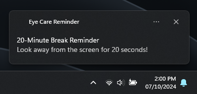

# Eye-Care-Reminder
This is a lightweight Windows program designed to help you follow the 20-20-20 rule to prevent eye strain during prolonged computer use.

## What is the 20-20-20 Rule?
The **20-20-20 rule** recommends that for every **20 minutes** of screen time, you should look at something **20 feet away** for at least **20 seconds**. This helps reduce digital eye strain and protect your eyes from fatigue.

## Features
- **First-time welcome message**: On first run, the program greets you with a welcome notification.
- **20-minute reminder**: Every 20 minutes, a toast notification reminds you to take a 20-second break.
- **Look back notification**: After 20 seconds, another notification informs you that you can return to your screen.
- **Logs events**: The program logs all notification events to a text file in your Documents folder.

## Notification Example


## How to Install and Use
1. **Convert PowerShell Script to Executable**:
   You can convert the PowerShell script to an executable (.exe) using the `ps2exe` tool. Run the following command in PowerShell:

   ```powershell
   ps2exe -inputFile EyeCareReminder.ps1 -outputFile EyeCareReminder.exe -iconFile "path_to_icon.ico"
   ```
   
   This command converts the PowerShell script into an executable with an icon.

2. **Set EyeCareReminder to Start at Windows Boot**:
   To automatically start the program when Windows boots:

    - Press ```Windows + R```, type ```shell:startup```, and press Enter.
    - Copy the ```EyeCareReminder.exe``` file into the folder that opens. This will start the program whenever Windows starts.
  
3. **Download Executable**:
   You can download the pre-built executable from [here](./exe/EyeCareReminder.exe).

## How to Close the Program
To stop the program, follow these steps:

1. Open Task Manager by pressing ```Ctrl + Shift + Esc```.
2. Under the **Processes** tab > **Background Processes**, find the **EyeCareReminder** application.
3. Right-click on it and choose **End Task**.

## Log File Location
All notifications are logged in the following location:

```powershell
C:\Users\<YourUsername>\Documents\EyeCareReminder\log.txt
```
The folder and log file will be automatically created if they don't already exist.

## License
[](https://opensource.org/licenses/Apache-2.0)
